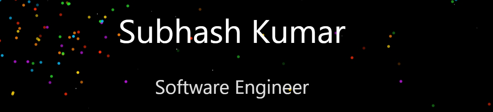

<a href="https://www.subhashkr.netlify.com/"><!-- wi*quL3fcV --></a>

- 🔭 I’m currently working on [My Portfolio](<amazonClone>)

- 🌱 I’m currently learning **Data Science**

- 👨‍💻 All of my projects are available at [<myportfolio>](<myportfolio>)

- 📝 I regularly write articles on [<blolink>](<blolink>)

- 📫 How to reach me **subhashkr855@gmail.com**

- 📄 Know about my experiences [<resumellink>](<resumellink>)

- ⚡ Fun fact **I like to learn new things**

<h3 align="left">Connect with me:</h3>

<a href="https://www.linkedin.com/in/subhash-kr0" target="blank">Linkedin</a>
<a href="https://x.com/subhash_k0?t=l3B56qDD-1oF_uXLrOU7sw&s=09" target="blank">twitter</a>
<a href="https://instagram.com/subhash_k0" target="blank">instagram</a>
<a href="https://www.facebook.com/profile.php?id=61559916877747&mibextid=ZbWKwL" target="blank">facebook</a>
<a href="https://www.youtube.com/c/youtube" target="blank">youtube</a>
<a href="https://discord.gg/discode" target="blank">discord</a>
<a align="right" href="https://dev.to/dev" target="blank">dev</a>

<a href="https://www.hackerrank.com/profile/subhash_kr0" target="blank">hackerrank</a>
<a href="https://codeforces.com/profile/codeforces" target="blank">codeforces</a>
<a href="https://www.leetcode.com/leetcode" target="blank">leetcode</a>
<a href="https://codepen.io/codepen" target="blank">codepen</a>
<a href="https://huggingface.co/" target="blank">huggingface</a>
<a href="https://stackoverflow.com/users/stackoverflow" target="blank">stackoverflow</a>

<a href="https://codesandbox.com/codesandbox" target="blank">codesandbox</a>
<a href="https://dribbble.com/dribble" target="blank">dribble</a>
<a href="https://www.behance.net/behance" target="blank">behance</a>
<a href="https://hashnode.com/hashnode" target="blank">hashnode</a>
<a href="https://medium.com/@subhashkr855" target="blank">medium</a>
<a href="https://www.codechef.com/users/subhash_kr0" target="blank">codechef</a>
<a href="https://kaggle.com/kaggle" target="blank">kaggle</a>

## Programming Languages

## Technologies

 
 
 
 
 
 
 
 
 

<!--  -->

<!-- ### 

 -->

<!-- 

 -->

<!-- ### Full Stack Projects

### Cybersecurity Projects

 -->

