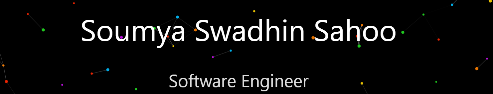
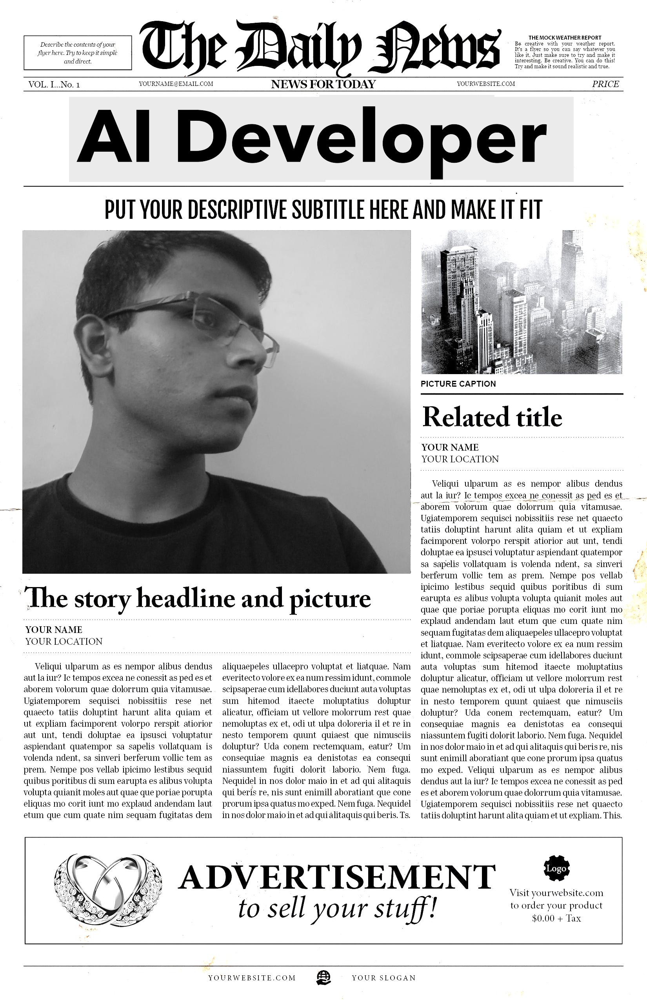
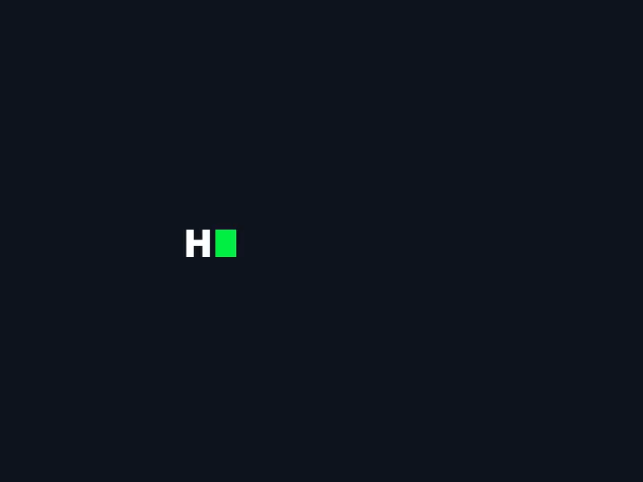

<h3> 🌟 About Me </h3>

- 💻 Software Engineer and Data Scientist. 
- 🛠️ Proficient in Python, Java, and Blockchain. 
- 🌱 Currently learning advanced cybersecurity topics. 
- 🔥 Passionate about open-source contributions and teaching coding in Hindi. 
- 💻 Software Engineer and Data Scientist. 
- 🛠️ Proficient in Python, Java, and Blockchain. 
- 🌱 Currently learning advanced cybersecurity topics. 
- 💻 Software Engineer and Data Scientist. 
- 🛠️ Proficient in Python, Java, and Blockchain. 
- 🌱 Currently learning advanced cybersecurity topics. 

<!-- 
 -->
 

<h3> Connect with Me </h3>

<!--  -->

  
  
  
  
 <!-- 
 -->
 
  

<!-- Footer -->
  

