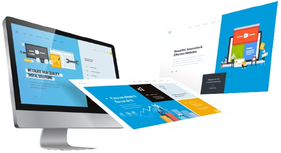

<!--  -->

</a>
<a href="https://github.com/subhash-kr0">

</a>

<!--

-->

 <!--  -->

<!--  -->

<!-- ### 🎧 Spotify Playing -->

  
       

<!--
 

<a href="https://www.snapchat.com/"> 

-->
<!--   <a href="https://www.twitch.tv/matyo91"> -->
<!--     <a href="https://www.hackerrank.com">    <a href="https://www.hackerrank.com"> -->

<!-- Footer -->

<!--

-->
