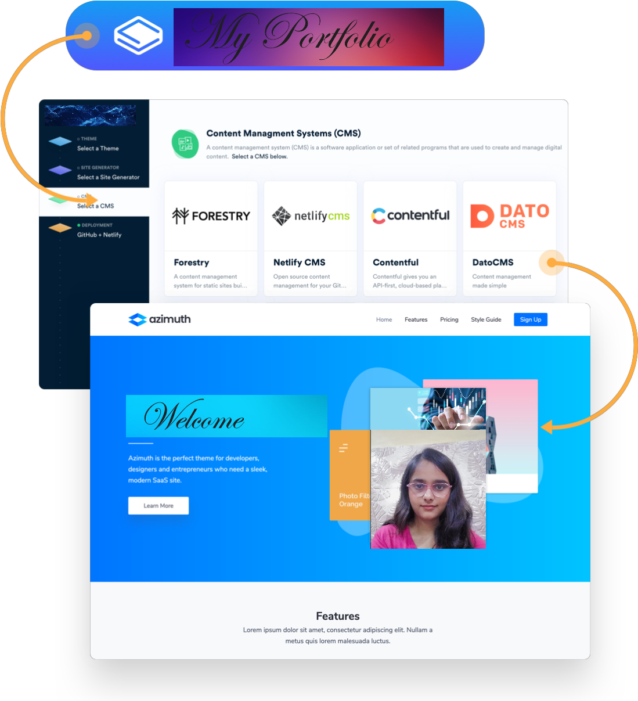
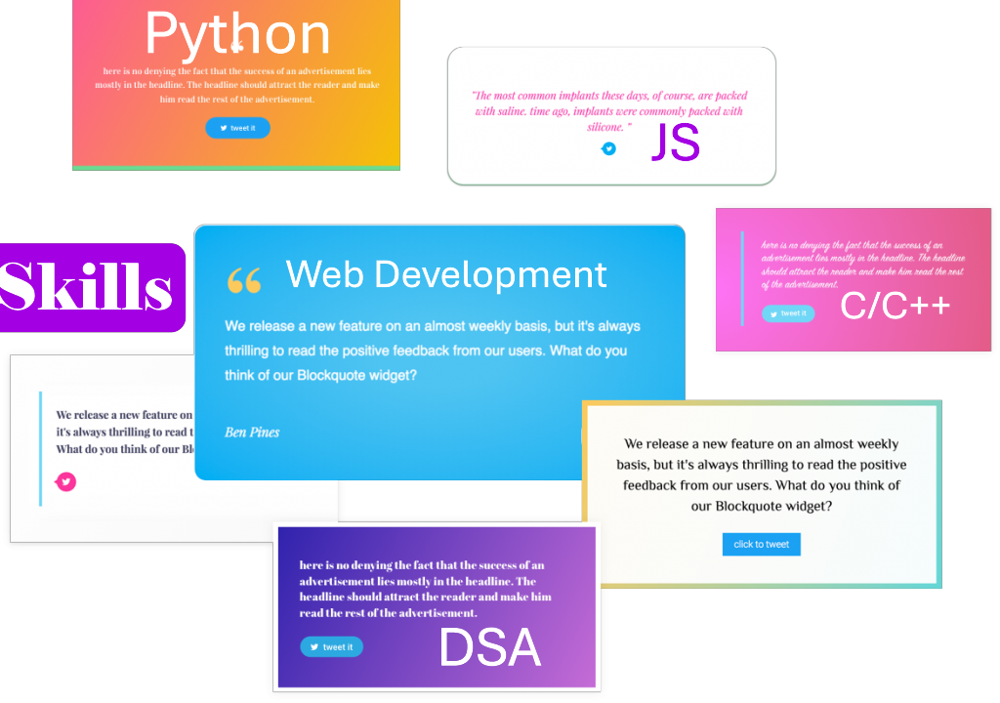

<!--  -->

### Hi there, I'm Subhash Kr! 👋

<!--  -->

### 🌟 About Me
- 💻 Software Engineer and Data Scientist.
- 🛠️ Proficient in Python, Java, and Blockchain.
- 🌱 Currently learning advanced cybersecurity topics.
- 🔥 Passionate about open-source contributions.
<!--- 💻 Software Engineer and Data Scientist.
- 🛠️ Proficient in Python, Java, and Blockchain.
- 🌱 Currently learning advanced cybersecurity topics.
- 🔥 Passionate about open-source contributions and teaching coding in Hindi.
-->

<!--  -->

### 🎧 Spotify Playing
<!--  -->
<!--  -->

 

<a href="https://www.snapchat.com/"> 

 

<!--   <a href="https://www.twitch.tv/matyo91"> -->
<!--     <a href="https://www.hackerrank.com">    <a href="https://www.hackerrank.com"> -->

<!--  -->

  
  
  
  
 <!-- 
 -->
 
  

<!-- Footer -->
  

