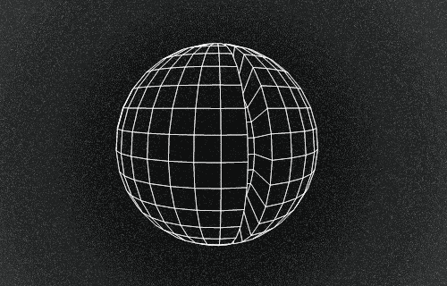
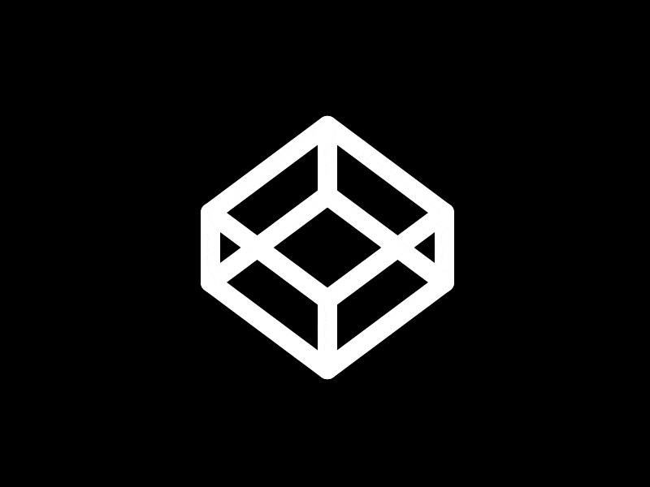
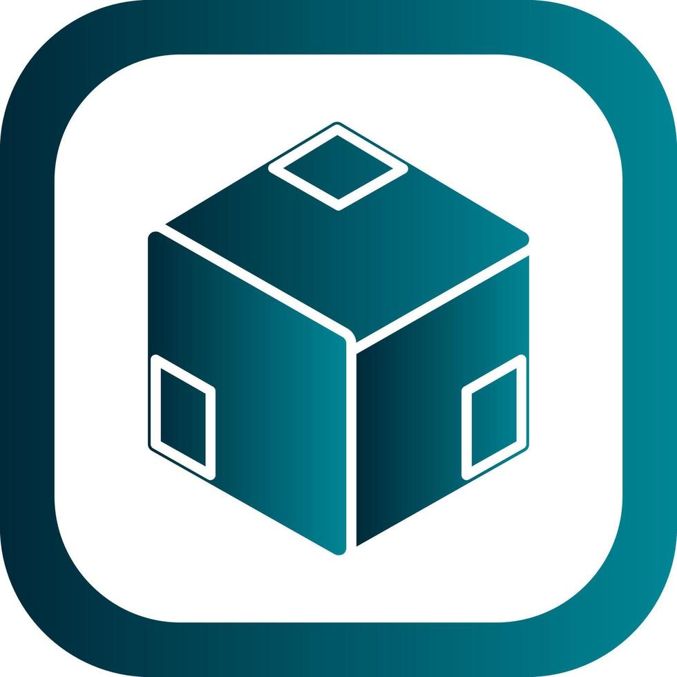
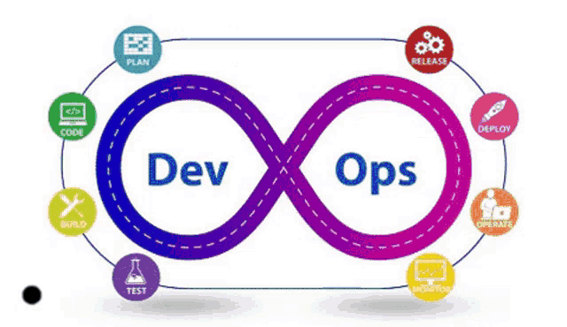
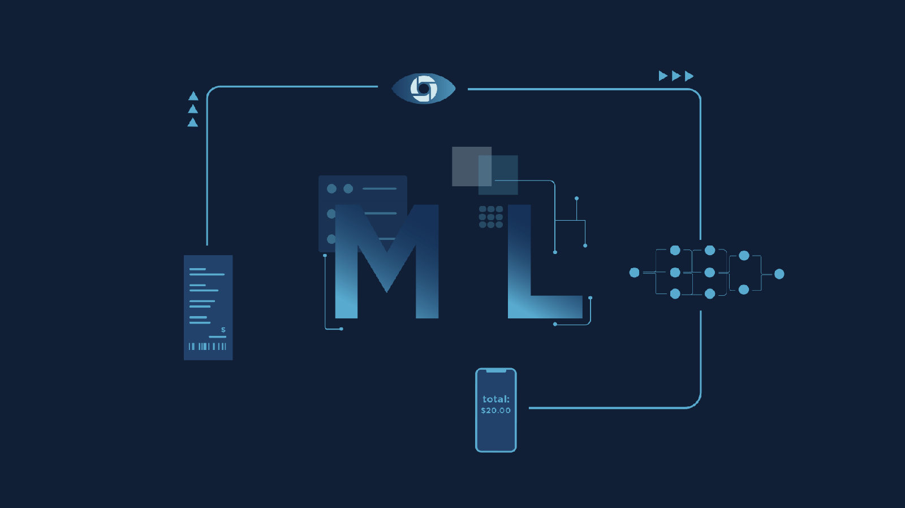

 
 
Welcome to My GitHub Profile

  

    
  

  

 

    Hey there,  &nbsp;&nbsp;&nbsp;I' m  
    

     &lt;/&gt;Subhash Kr/&gt;

 

    

ClickHere To More

    <ul style="list-style-type: none; padding-left: 0;">
     
      <li>👨🏻‍💻 I'm an imaginative and innovative thinker who loves to explore new ideas and concepts and bring them to life through my work and projects. ✨🌱💡</li>
      <li>👉🏻 I'm a curious and adventurous soul who constantly thrives on discovering new knowledge, exploring different perspectives, and pushing myself to learn and grow in all areas of life. 🌍📚🌟</li>
      <li>👉🏻 I'm a creative and innovative thinker who loves to explore new ideas and concepts and bring them to life through my work and projects. 🎨💡🚀</li>
      <li>👉🏻 With a passion for making a difference in the world, I'm driven to use my skills and talents to contribute to meaningful causes and make a positive impact in the lives of others. 🌍❤️🌟</li>
      <li>👉🏻 As a problem solver, I'm skilled at breaking down complex challenges into manageable pieces and finding creative solutions that address the root causes of issues. 🧩💡🔍</li>
      <li>👉🏻 I'm a natural leader who excels at bringing people together, building teams, and guiding them toward shared goals and visions. 🙌🤝🌟</li>
    </ul>
  

## &nbsp;&nbsp;&nbsp; Hello Developers
- 🔭 I’m currently working on [My Portfolio](<amazonClone>)
  
 
- 🌱 I’m currently learning **Data Science**

- 👨‍💻 All of my projects are available at [<myportfolio>](<myportfolio>)

- 📝 I regularly write articles on [<blolink>](<blolink>)

- 📫 How to reach me **📧subhashkr855@gmail.com**
 
<!-- - 📄 Know about my experiences [<resumellink>](<resumellink>) -->

- ⚡ Fun fact **I like to learn new things**

<!-- 
 -->

    

        <h2 style="display: flex; align-items: center;">
            &nbsp; Connect With Me
            
        </h2>
    

    
    
    
    
    
    
    
    
    
    
    
    
    
    
    
    
    

<!-- 
 -->

<h1>🔧 SKILLS & TECHNOLOGIES</h1>

    

        
        
Cyber Security

    

    

        
        
Blockchain Dev

    

    

        
        
Web Development

    

    

        
        
Data Scientist

    

    

        
        
Ethereum

    

    

        
        
DevOps

    

    

        
        
Android Dev

    

    

        
        
UI/UX Design

    

        

        
        
Artificial Intelligence

    

        

        
        
Machine Kearning

    

<h1>  </h1> 

  

  
  
  
  
 

  

